> Kudos to [@matthewzring][] (and `Discord@Frosty#9449`) for the [101 Guide][] (from which this guide was modified).
> But – if only it’s enough! Discord needs some comprehensive and updated documentation…

[@matthewzring]: https://github.com/matthewzring
[101 Guide]: https://gist.github.com/matthewzring/9f7bbfd102003963f9be7dbcf7d40e51


# Discord Markdown 201

Wanna inject some flavor into your everyday text chat? You’re in luck!
Discord uses a variant of Markdown, a simple plain-text formatting system that **makes your sentences stand out**.
Just add a few ornaments around your text to change it!


## Sweet Styles

| Style | Markdown |
|:-:|:-:|
| *Italics* | `*italics*`[^x] or `_italics_` |
| **Bold** | `**Bold**` |
| <u>Underline</u> | `__Underline__`[^d] |
| ~~Strikethrough~~ | `~~Strikethrough~~` |
|  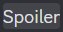 | `\|\|Spoiler\|\|`[^d][^s] |
| [Link](https://example.com) | `[Link](https://example.com)` |

On Desktop/Web, you can see a preview of your text formatted with these options
(except for [Link](https://example.com/)) right in the message box.
You’re gonna need some imagination if you are a Mobile user or switched on the
*legacy chat input* in the Accessibility settings 👌.

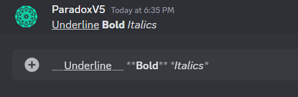

It doesn’t show on the Desktop/Web preview (at this writing), but *formatting can span multiple lines*![^n]

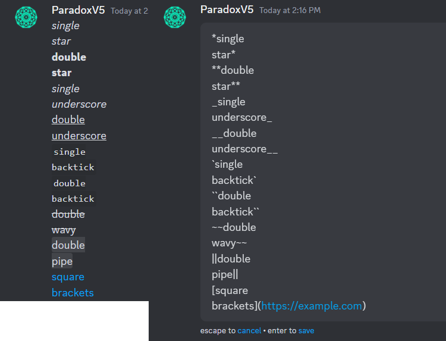

You can even mix n’ match formatting options into more powerful ones, such as ***<u>underline bold italics</u>***
(`**___underline bold italics___**` or `*__**underline bold italics**__*` or etc.).

Just dropping a web address without the `[]()` markdown also *links* it up (the Desktop/Web preview turns it blue too),
which you’ve probably done several times. Both links also supports previews if the linked site has them set up.


By the way, Discord found a way to stop you from hiding rickrolls or malware behind legit links.
Perhaps this sanitization is why Discord hot-reverted the newer Markdown features
and didn’t reïntroduce links until a couple of months after the others returned.


Don’t want to invoke Markdown?
**You can slap a backslash`\` directly preceding the expression, and it’ll escape the formatting.
The same goes with any backslash Markdown thinks you are escaping something with.**
You’ll see the arms of your customized shruggie as you’d like!
(A web address on its own has no Markdown and can’t be escaped,
but linked text is Markdown and escaping it exposes its web address which gets linked on its own.)

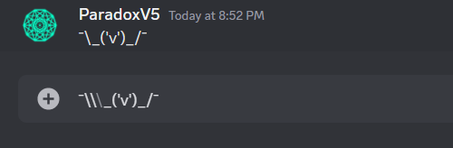


## Code Blocks

Markdown also has code formatting. In addition to making your text stubby and nerdy,
code blocks are also unique because they disable Markdown formatting for their contents.
*You know what I’m talking about if you ever copy-pasted code or ASCII art and found Discord turning it into pasta.*
(You can still *`combine with italics and et cetera`* from the outside.)

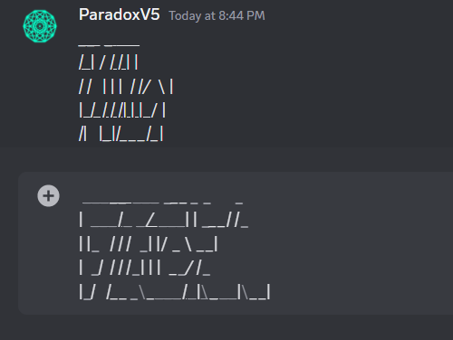

You can make some of your text `code-looking` with `inline code` (like what I’ve done in this guide)
by wrapping them in single or double backticks`` ` `` the same way as bolds and italics.
The point of double backticks (``` `` ```) is in case you want to put single backticks (`` ` ``) in there.
(Because code formatting disables Markdown inside, backslashes`\` are out too.)

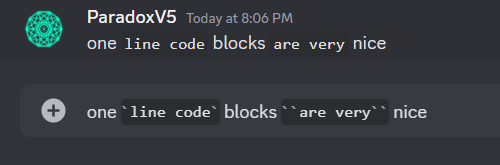

You can also create multiline code blocks by placing triple backticks (```` ``` ````) before and after it.
Although Discord (unlike other Markdown apps) doesn’t require so *(most of the time – you’ll soon see)*,
the good habit is to place them on lines separate from the contents to be consistent.
A great convenience for Desktop/Web is that, while under a block code,
pressing `↩ Enter`/`⌅ Return` starts a new line instead of posting your half-finished haiku early.

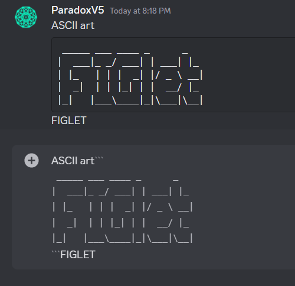

For those coders out there, to *really* spice up your code blocks,
you can denote a specific coding language by typing its name/ID right after the backticks that start your code block.
If Discord supports the language,
Desktop/Web gets fancy-schmancy **syntax highlighting** in both the chat and the non-legacy editor.
Mobile does not support syntax highlighting (yet?).

> 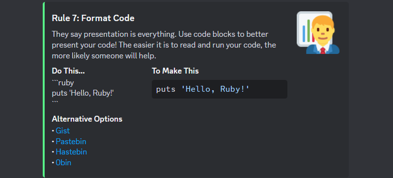
> <br> ⸺ Ruby Discord #rules [screenshotted PTB175517] (using with original author’s permission)

Different languages have more-or-less different approaches to highlightable syntax.
Complete list with previews (possibly different colors): [highlight.js demo](https://highlightjs.org/static/demo/)

Note that if there’s a space anywhere on the line after the beginning backticks (where your language goes),
Discord takes that you forgot the good habit and treats it as part of your content.

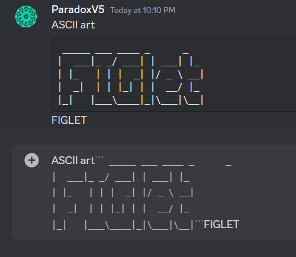


## Lists

* You can start a bullet list with either `*` or `-` and one or more spaces beginning the line.

1. For a numbered list, begin the numbered line with *any* non-negative number, a period and one or more spaces (e.g., `1. `).

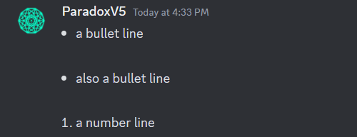

Lists don’t have previews in the message box at this writing.

You can indent lines (*list or regular lines!*) within a list by padding spaces in front.


The number of indent spaces should match the number of characters in the index part of the previous level,
though Discord rounds space counts up and allows extra spaces in the indent[^d]. Like with ASCII art,
the monospace font of a temporary [code block](#code-blocks) can aid if counting spaces gets tedious.

> ```
> * Level 1 line
>  * Discords rounds up
>   * but for consistency, you should match Level 0’s indent
>    * same deal at other levels
>     * this Level 2 has 4 characters for the index
>      * so indents with 4 spaces or less are all level 3
> * another Level 1
>    * extra indents have no effect
>     * other than requiring more spacebar strikes
> *   Level 1 with 2 extra spaces after `*`
>   * this Level 1 has 4 characters for the index
>     * so indents with 4 spaces or less are all level 2
> 1. same deal with number indices
>   * this Level 1 has 3 characters for the index
>    * so indents with 3 spaces or less are all level 2
> ```
> 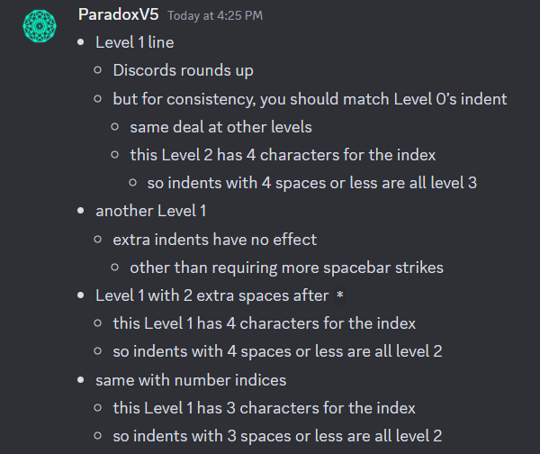

For Discord Markdown, only the first list line decides the list index (you can start with any ).
Thus, the indices of your list don’t need to match (only the first index declares a bullet or the starting number).
Consequently, bullet and numbered list can’t mix in the same (sub)list.

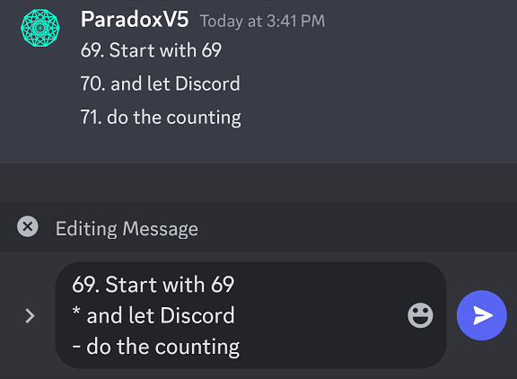[^d]


## Block Quotes

To turn messages into Block Quotes, start your lines with `> ` or `>>> ` (including the one space).
Block quotes imply that a piece of text is from somewhere else,
such as Google or (back when Replies weren’t a thing) other people’s messages.

`> ` at the beginning of a line of text creates a single-line block quote.

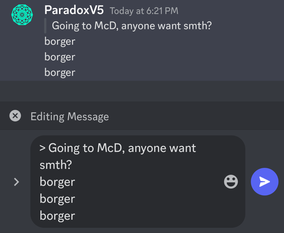

On Mobile (and ancient versions of Discord such as the one 101 used),
`>>> ` at the beginning of a line of text puts that line and the rest of your message in a multiline block quote.[^d]
[This screenshot was retaken on Mobile 175.16; Mobile 165.15 was missing the gray quote-indent line.]

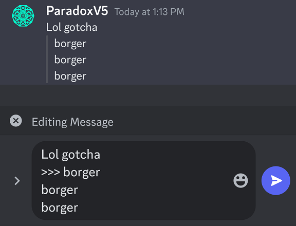

Multiline block quotes save the need to punch `> ` on every line, especially for code blocks which disable Markdown.
(Ignore the missing leading space, it’s a long-running Mobile-only 🐛 and occurs both inside a block quote and outside.)

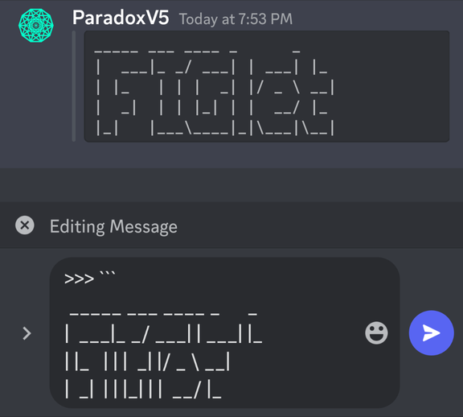

On Desktop/Web not using the *legacy chat input* from the Accessibilities menu,
both `> ` and `>>> ` also directly become a gray quote-indent line in front of their line inside the message box,
similar to how Discord formats quotes in the chat. If you start a new line[^n] from this indented text,
Discord conveniently quote-indent your new line for you.
Hitting `⌫ Backspace` next to the quote-indent deletes it and brings you out of the block quote (as expected).

A side effect of this *convenience* is that Desktop/Web’s non-legacy editor does not distinguish `>>> `-based multiline
quotes from `> `-based ones and cannot create them; fortunately, those sent from Mobile are still formatted in the chat.

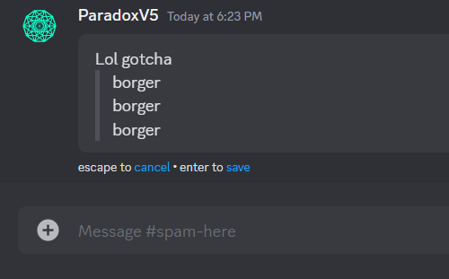
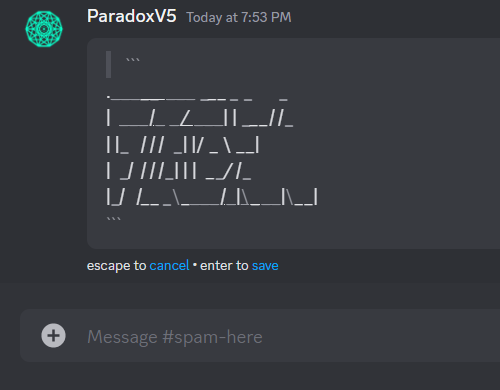


## Headings

To create a heading, prefix a line with 1–3 hashtag`#`s followed by one or more spaces.
The more `#`s, the smaller the heading. Markdown supports up to six `#`s, though Discord Markdown only goes to three.

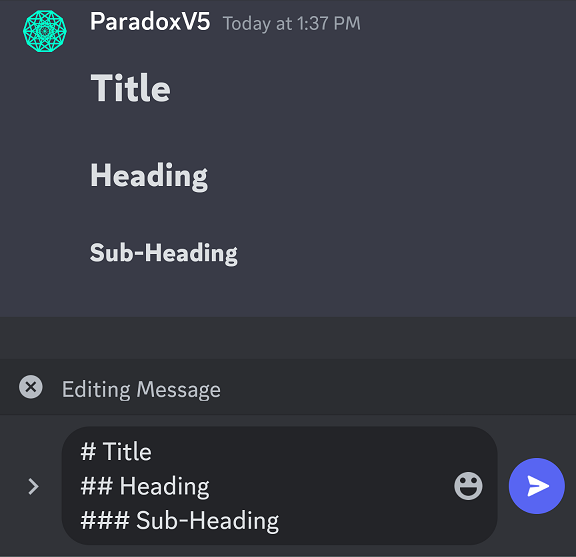

Yes, you can mix n’ match [Sweet Styles](#sweet-styles) inside your headings too.
Headings are **Bold** by default though, so **Bold** does nothing in headings.


---

> And now you’re a **Discord text Markdown super-expert**. Go out there and highlight your accomplishments!


[^x]: This does not apply on Desktop/Web if a space follows the first `*` (i.e., `* text*` or `* text *`)
  [tested Web 192149 & 198920, Desktop PTB 193325 & 198953]; it also does not apply on Mobile if a space precedes the second `*`
  (i.e., `*text *` or `* text *`) [tested Mobile 175.16 & 178.19].
[^d]: These are possibly unique to Discord’s Markdown and not found on other Markdown apps like GitHub.
[^s]: Also check out: [Discord’s support article on spoilers](https://support.discord.com/hc/en-us/articles/360022320632-Spoiler-Tags-)
[^n]: *Huh? You didn’t know you can send multiline messages on Desktop/Web with `⇧ Shift` + `↩ Enter`/`⌅ Return`?*
